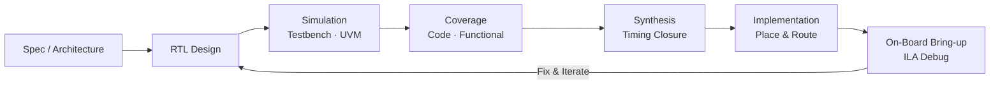

<div align="center">

# Ethan

**Digital Hardware Engineer** &nbsp;·&nbsp; RTL Design / Verification / FPGA System Integration

<sub>`SystemVerilog` &nbsp;·&nbsp; `UVM` &nbsp;·&nbsp; `RISC-V` &nbsp;·&nbsp; `FPGA` &nbsp;·&nbsp; `Embedded Vision`</sub>

<br>

<!-- TODO: 아래 링크를 본인 것으로 교체하세요 (없는 항목은 줄째로 삭제) -->
<a href="khb030508111@gmail.com"></a>
<a href="https://github.com/ethan000106"></a>
<a href="https://www.linkedin.com/in/your-id"></a>
<a href="https://drive.google.com/your-resume-link"></a>

</div>

---

## About

```
- 디지털 시스템을 RTL부터 검증, 보드 구동까지 직접 만들어 보는 것을 좋아합니다.
- FSM 설계, 프로토콜 인터페이스, 타이밍 이슈 디버깅에 관심이 많습니다.
- "동작한다"에서 멈추지 않고 왜 동작하는지 파형으로 확인하는 편입니다.
```

---

## What I Can Do

- **RTL Design** — FSM 기반 제어 로직, 파이프라인 데이터패스, 클럭 도메인 분리 설계
- **Verification** — UVM 환경 구축(Driver/Monitor/Scoreboard), SVA 기반 프로토콜 체크, 커버리지 기반 검증
- **Interface** — UART / SPI / I2C(SCCB) / AXI4-Lite 마스터·슬레이브 직접 구현
- **Bring-up & Debug** — 합성·타이밍 리포트 해석, ILA 캡처, CDC/메타스테이빌리티 대응
- **System Integration** — FPGA + 호스트(Python/Jetson) 연동, 카메라 파이프라인 구성

---

## Tech Stack

| Category | Tools |
|:--|:--|
| **HDL & Verification** |     |
| **Language** |    |
| **EDA & Tools** |      |
| **Interface** |      |
| **Board / Device** |     |

<!-- 참고: Verdi, Design Compiler, PrimeTime 등 실제로 다뤄본 툴이 더 있다면 EDA 행에 추가하세요.
     반대로 경험이 얕은 툴은 빼는 편이 면접에서 안전합니다. -->

---

## Projects

| Project | Summary | Stack | Result |
|:--|:--|:--|:--|
| **FPGA Whack-a-Mole Game** | 2-board FPGA 시스템. UART 패킷 통신 기반 게임 로직 + OV7670 카메라 HSV 색 검출로 타격 판정 | `SystemVerilog` `UART` `VGA` `OpenCV` | *TODO: 동작 클럭 / 자원 사용률* |
| **OV7670 Camera Pipeline** | SCCB 초기화 ROM 설계, 프레임 버퍼 → VGA 출력, HSV 색상 검출 모듈 | `SystemVerilog` `SCCB/I2C` `VGA` | *TODO: 해상도 / 프레임레이트* |
| **RISC-V RV32I Core** | 5-stage pipeline CPU, hazard detection & forwarding unit 구현 | `SystemVerilog` `RV32I` | *TODO: 최대 동작 주파수 / CPI* |
| **UVM Verification Env** | Generator–Driver–Monitor–Scoreboard 구조 기반 FSM/프로토콜 검증 환경 구축 | `UVM` `SystemVerilog` | *TODO: 코드/기능 커버리지 %* |
| **Ultrasonic Distance Module** | HC-SR04 인터페이스 FSM, Q16 고정소수점 거리 연산 | `SystemVerilog` `Basys3` | *TODO: 측정 오차 범위* |

<!-- TODO
  1) 프로젝트 이름에 저장소 링크를 걸어주세요.
     예) | **[FPGA Whack-a-Mole](https://github.com/ethan000106/repo-name)** | ... |
  2) Result 열은 면접관이 가장 먼저 보는 칸입니다. 반드시 실제 측정값으로 채우세요.
     (Vivado Timing Summary의 WNS, Utilization Report의 LUT/FF/BRAM 수치 등)
-->

---

<details>
<summary><b>🔍 Selected Debug Cases</b> &nbsp;<sub>— 직접 잡은 버그와 원인</sub></summary>

<br>

| Symptom | Root Cause | Fix |
|:--|:--|:--|
| 특정 조건에서 FSM이 멈춤 | `default` 미정의로 illegal state 진입 후 복귀 불가 | 전체 상태 인코딩 + default 복귀 경로 추가 |
| 이벤트가 여러 번 트리거됨 | level 신호를 edge 조건처럼 사용 | 1-cycle pulse 생성 로직으로 변경 |
| 통신 중 패킷이 간헐적으로 유실 | checksum 불일치 시 재동기화 미구현 | RX FSM에 resync 상태 추가 |
| 버튼 입력이 튐 | 비동기 입력 + 채터링 | 2-FF 동기화기 + 디바운스 카운터 |

<sub>실제로 겪은 케이스만 남기고, 파형 캡처 이미지를 함께 올리면 설득력이 크게 올라갑니다.</sub>

</details>

<details>
<summary><b>⚙️ Design & Verification Flow</b></summary>

<br>



</details>

---

## Currently Learning


---

## Education

<!-- TODO: 학교 / 전공 / 수료 과정 / 자격증을 채워주세요 -->
- **OOO University** — OOO공학과 (20XX ~ 20XX)
- **OOO 과정 수료** — RTL 설계 및 검증 / On-Device AI (20XX)

---

## GitHub

<div align="center">


</div>

---

<div align="center">
<sub>Built with SystemVerilog, coffee, and a lot of waveform staring.</sub>
</div>
